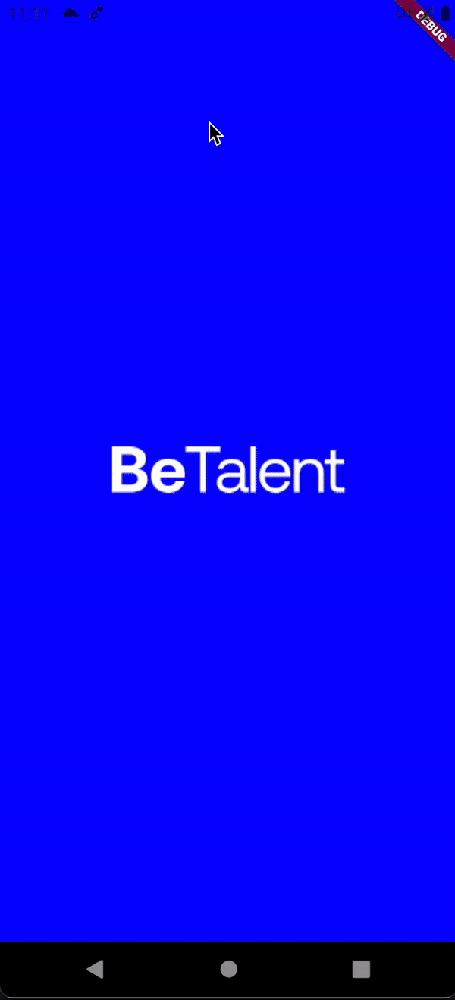

# App Teste BeTalent
 
 O projeto foi realizado a partir do desafio proposto pela equipe da BeTalent, o qual consistia em criar as telas apresentadas no [Figma](https://www.figma.com/design/Lpdera6rS8SztMUAwzkpN0/Teste-T%C3%A9cnico-Mobile-BeTalent?node-id=1-3&node-type=canvas&t=iLM9RwXWEJ7DSDcL-0).
 
  ## Detalhes do Desenvolvimento:
  * Versão Flutter `3.22.2`
  * Dart `null safety`
  * Chamadas HTTP `Dio`
  * Injeção de Dependências `Provider`
  * Gerencimanto de Estado `Value Notifier` e `State Pattern`
  

  ## Resultado Final:
  
 

 
 

 
 ## Rodar o Projeto
 ### Android
 Para rodar no Emulador Android é necessário configurá-lo para usar o Proxy com o Host name `10.0.2.2` e Porta `8080`.
 ### IOS
 Para roda no Simulador IOS não é necessário nenhuma configuração adicional.

